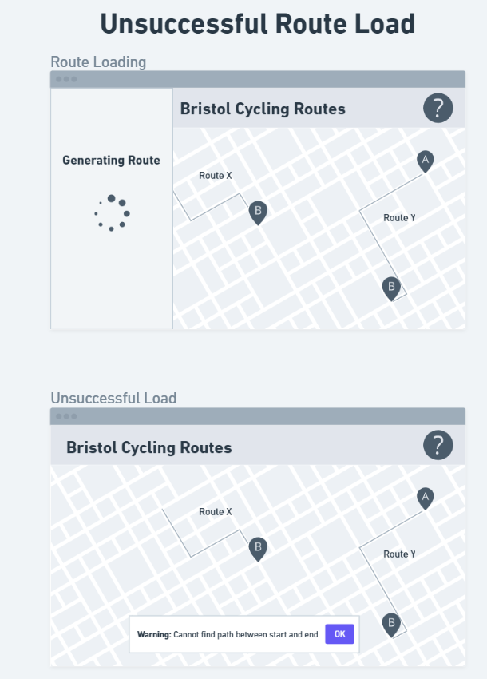

# Design Draft

Please note that the following design is a draft that was redesigned during development to make it more user-friendly, as we decided during development that it was not to the degree that we had wished.

## User Interface design
The user interface for the program has been designed for each menu. It has a standard colour palette which is subject to change - the structure of the menus will remain the sane.

## Design Overview

These are all the currently planned menus and user interfaces.

## Inspect Route UI

As shown in the diagram, when a route is clicked it will open up the "inspect route" user interface, which shows details regarding the route.

## Generate Route

One of the two principle uses of the program, generating routes, can be navigated to as seen below:

## Route Loading

This UI will display while a route is being generated. This is to make the site feel responsive and the user is aware that their input has been regarded.

## Successful Route Load

Ideally, this is the UI you will see the majority of the time a route is generated (while ignoring edge cases).

## Partial Route Load

When a route can only be created with gaps between several cycle paths, it will still be generated and the user will be alerted.

## Unsuccessful Route Load

Under certain circumstances, such as choosing locations not within the area of Bristol and South Gloucestershire that the data collection supports, no route will be able to created and this UI will be displayed.

# Redefined Design

## User Interface Design
The user interface for the program has been updated, making it more user-friendly and easy to use. The colour palette is not shown here, but the main colour for the program will be black (background colour of UI panels), the accent colour will be a neon green (Logo, headings and buttons) and the secondary accent will be white (standard text). This makes it more accessible to everybody due to the colour contrast, making it easily readable.

## Design Overview

These are all the newly planned menus. There is an added help menu, and route inspection and route generator outcomes have been updated.

## Inspect Route UI

Route's are displayed on the map by default, when hovered they are highlighted and when clicked they open up the right sidebar, which displays the route information to the user.

## Generate Route

One of the two principle uses of the program, generating routes, can be navigated to as seen below. This has been updated to use buttons for placing the start and end markers directly on the map, rather than typing an address. This is easier to use and more intuitive.

## Route Loading

This has not been changed - when a route is being generated it will show a loading wheel to ensure the user feels that the program is responsive and gives visual feedback to their inputs.

## Successful Route Load

If a route is successfully generated from point A to B, the route generation menu will be closed automatically and the new route will be highlighted.

## Unsuccessful Route Load

If a route is unable to be loaded due to there not being a direct path between the closest route to the start point and the closest route to the end point, a warning will be displayed to the user informing them.

## Open Help Page

Clicking the question mark in the top right corner will send the user to a help page, which displays some basic "FAQs" which serve to help the user in case they do not understand the program or its usage.

## Back to Main Page

You can return to the main page simply by pressing the back button on the help menu. It is clearly labelled with its own UI panel so that users do not get lost.
