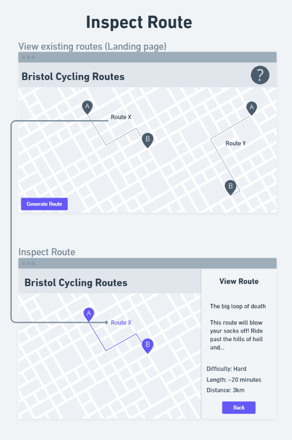

# Design

## User Interface design
The user interface for the program has been designed for each menu. It has a standard colour palette which is subject to change - the structure of the menus will remain the sane.

## Design Overview

These are all the currently planned menus and user interfaces.

## Inspect Route UI

As shown in the diagram, when a route is clicked it will open up the "inspect route" user interface, which shows details regarding the route.

## Generate Route

One of the two principle uses of the program, generating routes, can be navigated to as seen below:

## Route Loading

This UI will display while a route is being generated. This is to make the site feel responsive and the user is aware that their input has been regarded.

## Successful Route Load

Ideally, this is the UI you will see the majority of the time a route is generated (while ignoring edge cases).

## Partial Route Load

When a route can only be created with gaps between several cycle paths, it will still be generated and the user will be alerted.

## Unsuccessful Route Load

Under certain circumstances, such as choosing locations not within the area of Bristol and South Gloucestershire that the data collection supports, no route will be able to created and this UI will be displayed.
