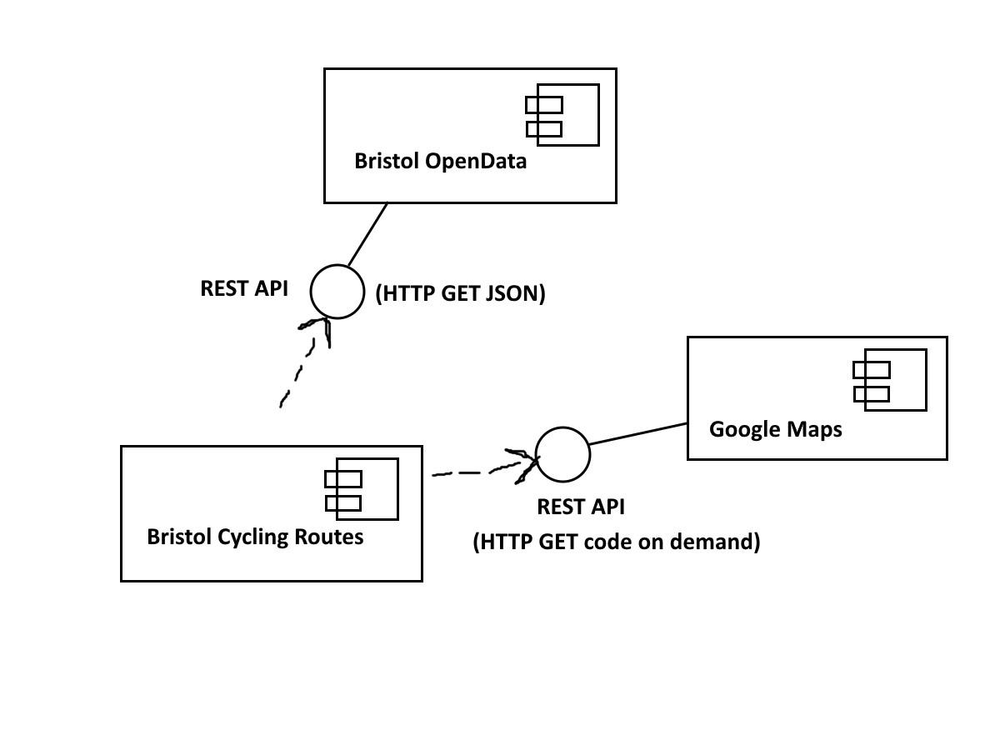
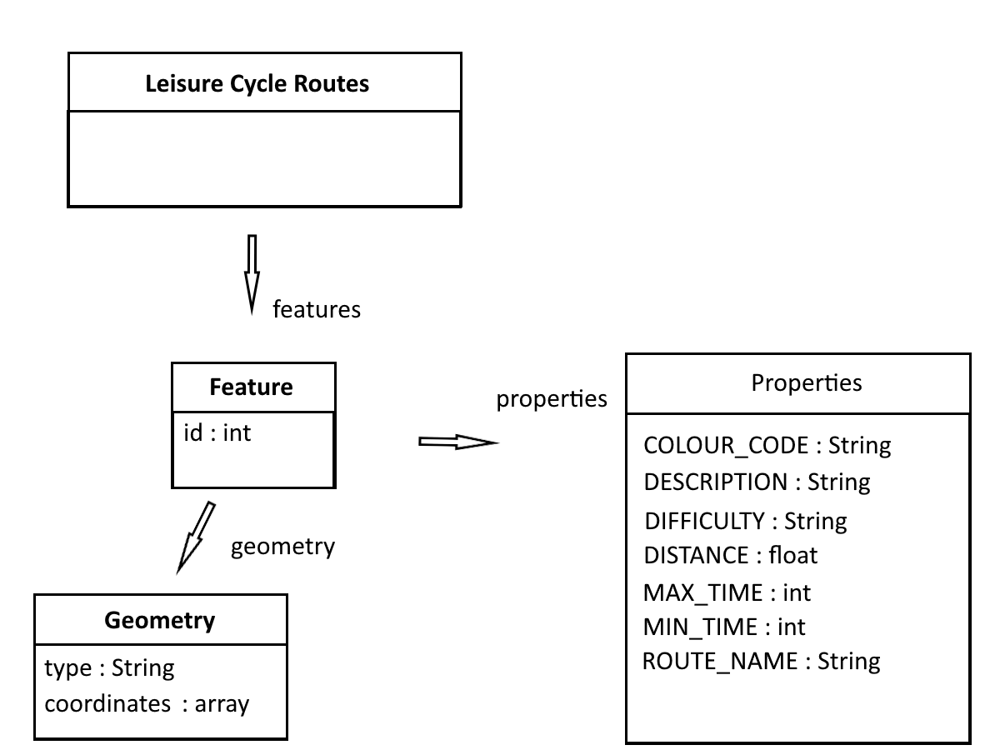

# Implementation

## Description of the System

The webapp uses the Bristol OpenData API to receive leisure cycling route information from the leisure rides dataset.
The Google Maps API and Google Maps Javascript API acts as a medium to visually display the geometry of the routes.
The user can view other properties of routes from the leisure rides dataset by hovering and clicking on a route. This 
is signalled to the user via the highglight of each route upon hovering over them. The user can also generate their own
routes (which use the existing known routes as paths) - the program converts each coordinate of each route to a node in a
graph and performs a dijkstra's algorithm on them. The edges of adjacent routes that are not inherently linked together in the
JSON query are linked together by being input into a quadtree data structure and testing nodes within nearby squares of the quadtree
to see if they are within a certain distance. In the end, this is displayed to the user with a thicker line than the rest of the routes.

## Project Structure

Here is a tree view of every file contained within the project folder.

- help page
  - help.html
  - styles.css
- main page
  - index.html
  - styles.css
  - index.js
  - img
    - help_icon.png
    - marker_icon.png
  - scripts
    - Algorithms
      - dijkstra.js
    - Data Structures
      - graph.js
      - quadtree.js
      - rect.js
    - Routes
      - customRoute.js
      - mainRoutes.js
      - route.js
      - routeMarkers.js
      - Route Generation
        - closestVertex.js
        - generateRoute.js
        - getNodes.js
        - latlngOffsetToKm.js
    - UI
      - leftSidebar.js
      - rightSidebar.js
      - warning.js
    - CycleAPI
      - cycleAPI.js
    - MapsAPI
      - drawPolylines.js
      - mapsAPI.js
      - markers.js

The help page has no javascript - it only uses html and css to display the information and so does not require a script folder or an index.js file.

The main page, however, has many different functionalities that had to be programmed, and so it has been split up into files extensively so that
code editing is easier.

Here is a description of each javascript file.

### index.js
index.js is simply the startup of the program. it invokes the google maps api through a function call, which starts the entire flow of the
javascript in the program.

### leftSidebar.js
leftSidebar.js is inside the UI module, and contains a single function used to open and close the left sidebar. It adds pre-defined CSS
animations to the sidebar using dynamic DOM manipulation. It is called from a button's onclick attribute defined in the HTML.

### rightSidebar.js
rightSidebar.js is inside the UI module, and contains two functions - one used to open and close the sidebar, and the other used to dynamically
add the appropriate route data to the view route menu.

### warning.js
warning.js is inside the UI module, and contains a single function used to create a warning alert panel in case of an error the user needs to be
notified of.

### cycleAPI.js
cycleAPI.js is inside of the CycleAPI module, and contains two functions - one that simply queries and receives the JSON from the Bristol OpenData
API, and the other converts the JSON received into an array of "routes", which are generic objects containing the route properties and the geometry
converted to an array of LatLng object literals that the google maps API can use.

### mapsAPI.js
mapsAPI.js is inside of the MapsAPI module, and contains a function used to startup the google maps API. This adds a script dynamically to the DOM,
containing our API key for the google maps API, and after the API is successfully queried it loads another function responsible for creating the map element.
This map element limits the user to the Bristol and south Gloucestershire area. Before the map is loaded, the user is prompted to allow permission for their
geolocation so that the map can be centered on them. If they do not allow it, they are centered on UWE. Finally, the function drawing the Bristol OpenData
routes is called, passing the program flow to another module.

### drawPolylines.js
drawPolylines.js is inside of the MapsAPI module, and contains two functions. One is treated as a private function that directly creates a google maps polyline
object using the polylineoptions passed to it, and the other acts as the function to call when creating a polyline. It defines specific presets for the polyline
for all the different cases that will use them.

### markers.js
markers.js is inside of the MapsAPI module, and contains a single function that is responsible for creating google maps advancedmarkerelements from a set of presets.
the marker object of type "advancedmarkerelement" is returned after it is created.

### routeMarkers.js
routeMarkers.js is isnide of the Routes module, and contains functions that handle the placement of route markers when generating a route. 

### route.js
route.js is inside of the Routes module, and contains the route class. The route class is used to create route instances that store the properties of each route, as well
as the google maps polyline that display them. they have functions to handle hovering over the route and clicking it.

### mainRoutes.js
mainRoutes.js is inside of the Routes module, and contains a single, simple function that simply calls the previously mentioned function that decodes the cycleAPI JSON, iterates
through each route, creating a new route instance from route.js.

### customRoute.js
customRoute.js is inside of the Routes module, and contains the customRoute class. This class is used similarly to the route class from route.js,
however instead it has the extra functionality required for the custom routes - markers showing the beginning and end point, as well as it lacking 
all the properties that a usual route would (difficulty, etc).

### graph.js
graph.js is inside of the Data Structures module, and contains a class definition for a graphNode. These graphNodes are to be used as the vertices of
a route, and so it stores which route it is contained within, an array of its edges and other properties that are necessary in a dijkstra's algorithm,
such as the previous node visited.

### rect.js
rect.js is inside of the Data Structures module, and contains a class definition for a 'rect'. A rect in this case is simply a rectangle, which has functions
to check if another rectangle is intersecting it, or if a point is contained within it. This is necessary for the next class definition.

### quadtree.js
quadtree.js is inside of the Data Structures module, and makes use of the previously mentioned rect class. This data structure is used to perform optimised
searches for nearby graph nodes, which greatly optimises the creation of the graph (and the adding of edges to nearby nodes) by a factor of 10, as this way
it uses linear time complexity compared to the polynomial time complexity found in a nested for loop alternative.

### dijkstra.js
dijkstra.js is inside of the Algorithms module, and contains a single function that performs a dijkstra's shortest path algorithm on a graph given a start and
end node.

### closestVertex.js
closestVertex.js is inside of the Route Generation submodule of the Route module, and does a search for the nearest route vertex to a location passed to the
function.

### getNodes.js
getNodes.js is inside of the Route Generation submodule, and it contains a single function that converts the routes into a graph, given the start and end point.

### latlngOffsetToKm.js
latlngOffsetToKm.js is inside of the Route Generation submodule, and it contains a single function that uses Haversine formula to convert two latitude and longitude
positions, which are used by the google maps API, into the distance between them in kilometers.

### generateRoute.js
generateRoute.js is inside of the Route Generation submodule, and contains two functions. One of the functions acts as the entry point, by checking that
the user-placed markers are valid (have been placed to begin with). If this is valid, the other method is called, which begins route generation. The route generation
algorithm works by finding the nearest vertex to the start and end markers. The routes are then converted to a large graph of connected edges and the dijkstra
is performed on this graph. Finally, the path is returned, if there is a valid path between them, and drawn to the screen using the customRoute class.

## Table of JSLint Warnings for each javascript file

| JS File                        | JSLint Warnings     |  
| ------------------------------ | ------------------- |
| index.js                       |  0                  |
| leftSidebar.js                 |  0                  |
| rightSidebar.js                |  0                  |
| warning.js                     |  0                  |
| cycleAPI.js                    |  0                  |
| mapsAPI.js                     |  0                  |
| drawPolylines.js               |  0                  |
| markers.js                     |  0                  |
| route.js                       |  0                  |
| routeMarkers.js                |  0                  |
| mainRoutes.js                  |  0                  |
| customRoute.js                 |  0                  |
| graph.js                       |  0                  |
| rect.js                        |  0                  |
| quadtree.js                    |  0                  |
| dijkstra.js                    |  0                  |
| closestVertex.js               |  0                  |
| getNodes.js                    |  0                  |
| latlngOffsetToKm.js            |  0                  |
| generateRoute.js               |  0                  |

## Software Architecture
The system mainly uses a functional approach to problems, decomposing solutions into single functions that are easier to edit, use and maintain. Basic object-oriented
ideas are used for data structures and routes, where classes are used to contain their related attributes and methods. The Bristol OpenData is queried
as a REST API, and the Google Maps API uses REST by dynamically loading its javascript with an API key embedded in a HTTP sourced script tag.

## Bristol Open Data API
There is a single query to Bristol Open Data API that fetches all the data needed for the entirety of the webapp's runtime. It makes a basic query to the API without options,
and it posts all the route properties and geometry. All of the data received is used to draw routes and display their properties to the user, and this information is not
subject to change, so this is sufficient for the program.

# User guide
TODO: Explain how each use-case works by providing step-by-step screenshots for each use-case. This should be based on a tested scenario.
