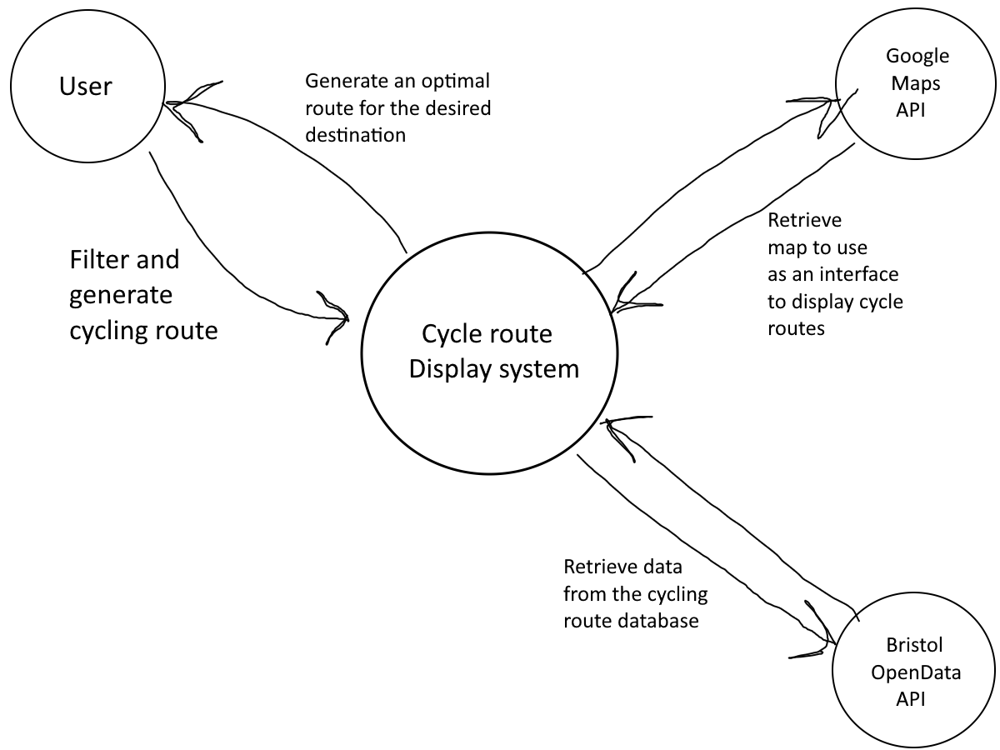

# Project Proposal

## Business Case

### Problem statement
In Bristol and South Gloucestershire, people who cycle don't have an easy way of finding leisure cycling routes and potentially may find that existing route planners are not fit to their ride-enjoyment needs. Important ride information, such as route difficulty or time-to-complete, are often lacking or non-existent, which can frustrate users who seek the best of both worlds - leisure rides containing route information and a route planner. The goal of this project is to make a web app to help users effortlessly plan their cycle journeys along leisure paths, discover new existing routes and choose their route based on its attributes.
 
### Business benefits
This cycling web app will make it easy for users to find information about cycling routes in Bristol and South Gloucestershire. It help users to choose better routes based on distance and difficulty. The webapp will be very user friendly with a responsive and simple design. It also promotes local tourism by encouraging exploration of different areas. Overall, the app supports healthy transportation.

### Options Considered
- Komoot: The Komoot app helps users to planning their cycling routes based on distance, difficulty, and terrain. It's good for road and mountain biking.
- Strava: A good app for tracking cycling activities and discovering new routes. Strava offers detailed ride statistics and route recommendations.
- Google Maps (Cycling Mode): Google map is the most popular in the world and it offers basic route planning for cyclists, showing bike lanes and paths for easy navigation.

We aim to improve upon the foundation of these existing applications by incorporating a selection of the best features found in them and putting them all in one place. 
- While Komoot is a great choice for route planning and leisure rides, it does not have any supported routes in Bristol or South Gloucestershire.
- Strava is a service with an interesting route selection and information, however it lacks a route generator/planner and instead has a strong focus on tracking your cycling journeys.
- Google Maps as a whole is amazing for getting from point A to point B, but it doesn't have a good range of information regarding cycling routes in particular, nor does it have a stake in the leisure-ride side of things.

### Expected Risks
Inaccurate Data: Inaccurate or outdated data of the routes.

Data Accessibility: If the Bristol Open Data API is not available, this app could not work as expected.

Technical issues: It may be challenging using the required APIs in such a complex way, given that we have not used before.

## Project Scope
- Connecting to the Bristol Open Data API.
- Displaying cycling routes with distance and difficulty levels.
- Generating bigger cycle routes made up of smaller ones between a start and end destination.
- Designing the user interface for the web app using HTML5, CSS and JS.
- Setting up a system to filter cycling routes based on user preferences

## Context Diagram

