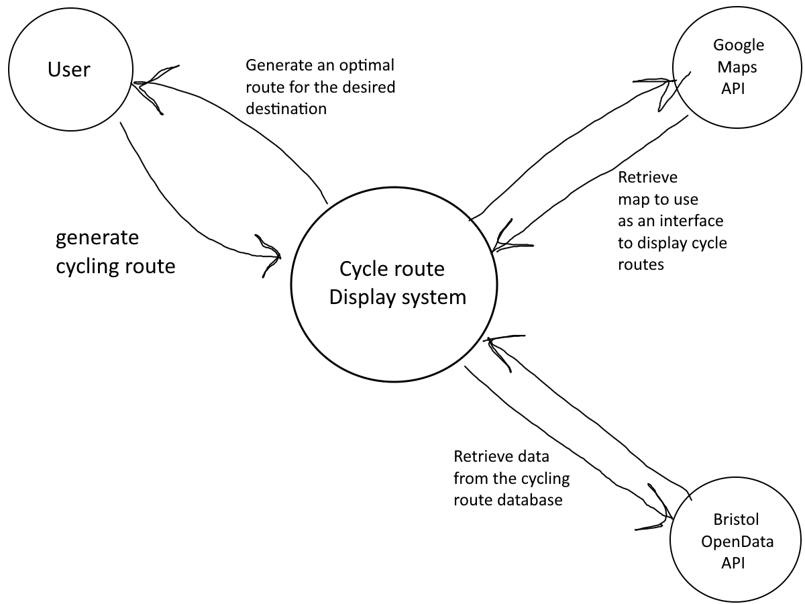

# Project Proposal

## Business Case

### Problem statement
In Bristol and South Gloucestershire, people who like to cycle don't have an easy way to find leisure cycling routes and information about cycling routes for leisure rides, especially routes with different distances and difficulty levels. Important details regarding routes, such as difficulty, are often lacking or non-existent which can make it hard for cyclists to view routes appropriate for their needs. The goal of this project is to make a simple web app to help users easily find information and explore different cycling routes for leisure, organized by distance and difficulty, in and around Bristol and South Gloucestershire.
 
### Business benefits
This cycling web app will make it easy for users to find information about cycling routes in Bristol and South Gloucestershire. It help users to choose better routes based on distance and difficulty. The webapp will be very user friendly with a responsive and simple design. It also promotes local tourism by encouraging exploration of different areas. Overall, the app supports healthy transportation.

### Options Considered
Komoot: The Komoot app helps users to planning their cycling routes based on distance, difficulty, and terrain. It's good for road and mountain biking.

Strava: A good app for tracking cycling activities and discovering new routes. Strava offers detailed ride statistics and route recommendations.

Google Maps (Cycling Mode): Google map is the most popular in the world and it offers basic route planning for cyclists, showing bike lanes and paths for easy navigation.

### Expected Risks
Inaccurate Data: Inaccurate or outdated data of the routes.

Data Accessibility: If the Bristol Open Data API is not available, this app could not work as expected.

Technical issues: It may be challenging using the required APIs in such a complex way, given that we have not used before.

## Project Scope
- Connecting to the Bristol Open Data API.
- Displaying cycling routes with distance and difficulty levels.
- Generating bigger cycle routes made up of smaller ones between a start and end destination.
- Designing the user interface for the web app using HTML5, CSS and JS.
- Setting up a system to filter cycling routes based on user preferences

## Context Diagram

