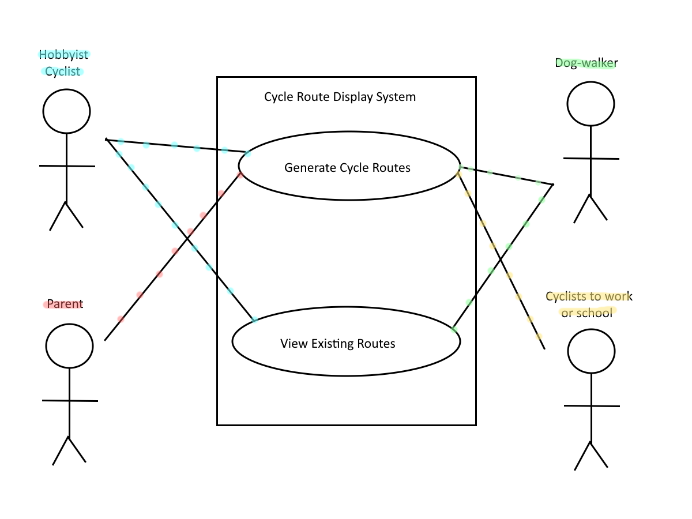

# Requirements

## User Needs

### User stories
As a cyclist I want a website I can connect to from my phone that generates optimal cycle routes
for me to follow to a destination so that I can cycle anywhere without having to know the way.

As a dog walker I like to walk my dog while riding my bike. I would like a website that I can use
from my phone that displays cycle paths for me so that I can see what are some interesting places
to walk my dog.

These two user stories describe the kind of users that can benefit from this cycle route display system.

### Actors
- Hobbyist cyclists:
They benefit from this by having the ability to generate cycle routes to different places
- Cyclists to work / school:
They benefit from this by being able to see avilable cycle paths near them
- Dog walkers:
The webapp can be helpful for them as they can see different areas where they could ride
their bike and walk their dog
- Parents:
This webapp would benefit parents by giving them access to the safest and most public cycle
routes that their children can take to school.

### Use Cases
 

| UC1 | Generate Cycle Routes |
| -------------------------------------- | ------------------- |
| **Description** | Allows the user to generate different cycle routes to a destination. |
| **Actors** | Hobbyist cyclists, Dog walkers, Parents, Cyclists work / school. |
| **Assumptions** | We have enough resources using the OpenData and Google Maps APIs to generate optimal routes. |
| **Steps** | User should input a start place and destination, and the webapp will receive cycle routes between these areas using the OpenData API and turn it into one consecutive route. |
| **Variations** | Occasionally, there will be no cycle paths in some areas. The user will be alerted of this, and the path will be split in the area where there are no cycle paths. |
| **Non-functional** | System should be fast and develop genuinely optimal or heuristic, close-to-optimal cycle routes with the data provided. |
| **Issues** | Issue around finding optimal cycle paths - potentially use a shortest path algorithm such as A-star algorithm |

 
 
| UC2 | View cycle routes on the map | 
| -------------------------------------- | ------------------- |
| **Description** |  Allows the user to view generated cycle routes visually on an interactive map.
| **Actors** |  Hobbyist cyclists, Dog walkers.
| **Assumptions** | The map service (e.g., Google Maps or OpenStreetMap) and the OpenData API are accessible into the web app to display the routes.
| **Steps** | The user selects a generated route they wish to view. The web app displays the selected route on the map, highlighting the path, start, and end points.The user can zoom in/out or pan to explore the route on the map. Additional information, such as distance, estimated time, or route difficulty, is displayed alongside the map for reference.
| **Variations** | If no routes are available in the selected area, the map will indicate this to the user. Users can choose between different map views, such as satellite, terrain, or street view, if supported by the map service.
| **Non-functional** | The map and routes should load quickly and be interactive, providing smooth zoom and pan functionality. The route lines and markers should be clear and distinguishable, even in areas with complex paths.
| **Issues** | Potential challenges with route rendering on the map if there are too many overlapping or complex routes. Ensuring map interactivity and responsiveness on various devices, particularly mobile.

## Use Case Diagram

## Robustness Diagram UC1

Add your robustness diagram here Mihiranga

## Robustness Diagram UC2

## Software Requirements Specification
### Functional requirements
Functional requirement:
- FR1: The system shall allow the user to generate a cycle route between two places and display it on a map (UC1)
- FR2: The system shall let the user to view existing cycle paths (UC2)
- FR3: The system shall display information about pre-existing routes such as the estimated time, difficulty and distance alongside the route (UC2) 

### Non-Functional Requirements
- NFR1: The system should generate optimal paths (UC1)
- NFR2: The system should be able to quickly generate paths (UC1)
- NFR3: The system should load routes and the map quickly to the page (UC2)
- NFR4: The system should have a responsive and smooth map interaction (UC2)
- NFR5: The system should have a map with clear and distinguishable paths (UC2)
